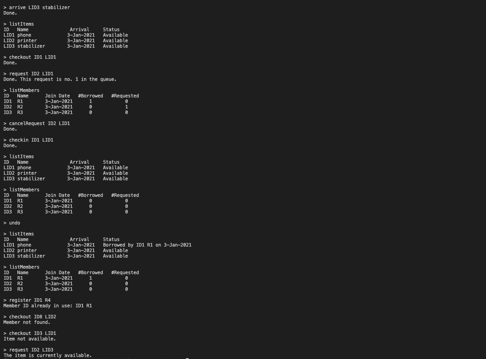

# ItemLoan-system
The item loan system created using Java language. 

System has multiple excpetion handling classes, interfaces, and redo, undo functionalities. 

Also, the program has various commands for item loaning, such as: 

startNewDay 'dd-mon-year'           - start a new day for system  
register 'user-id' 'user-name'      - for user registration  
arrive 'item-id' 'item-name'        - for item registration  
checkout 'user-id' 'item-id'        - for user item checking out  
request 'user-id' 'item-id'         - for user to get on a waiting queue for an item  
cancelRequest 'user-id' 'item-id'   - for user cancel the item request  
listMember                          - for listing all members  
listItems                           - for listing all items  
undo                                - undo previous action  
redo                                - redo action  

First of all, need to input the filename where all commands are stored. Example commands can be found in src.text.  
Result:

